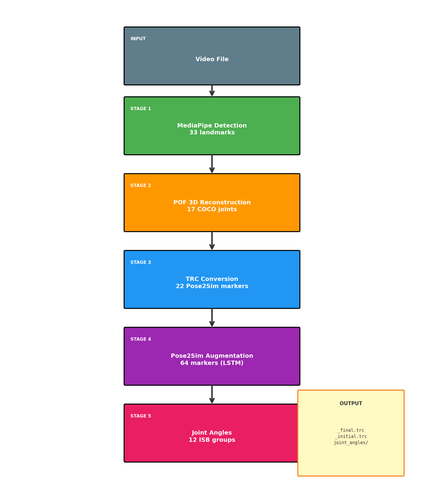
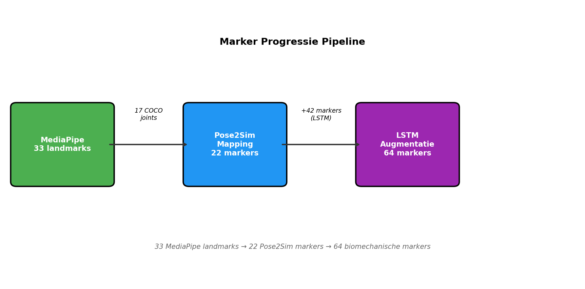
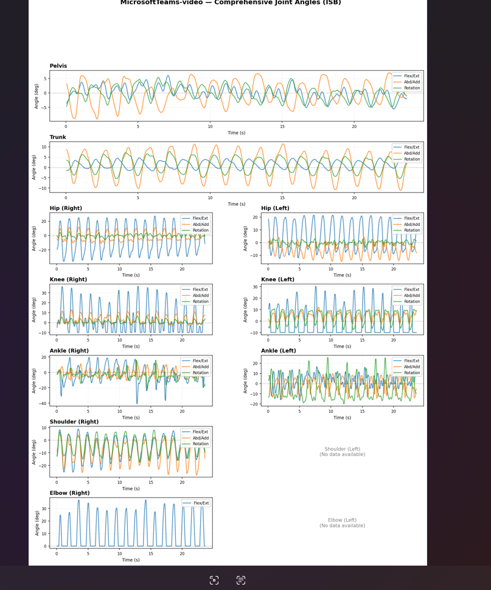

# 5. Bevindingen en Ontwerp/Ontwikkelkeuzes

## 5.1 Architectuurkeuzes

### Waarom Modulaire Architectuur?

De pipeline is opgebouwd uit onafhankelijke modules die via gedefinieerde interfaces communiceren:

```
┌─────────────┐    ┌─────────────┐    ┌─────────────┐
│ MediaPipe   │───▶│ POF 3D      │───▶│ TRC         │
│ Detector    │    │ Reconstruct │    │ Converter   │
└─────────────┘    └─────────────┘    └─────────────┘
                                            │
                                            ▼
┌─────────────┐    ┌─────────────┐    ┌─────────────┐
│ Joint       │◀───│ Joint       │◀───│ Pose2Sim    │
│ Output      │    │ Constraint  │    │ Augment     │
└─────────────┘    │ Model       │    └─────────────┘
                   └──────┬──────┘
                          │
                   ┌──────▼──────┐
                   │ Joint       │
                   │ Angles      │
                   └─────────────┘
```

**Voordelen:**
- Onderhoudbaarheid: wijzigingen in één module beïnvloeden andere niet
- Testbaarheid: elke module apart testbaar
- Herbruikbaarheid: modules kunnen in andere projecten worden ingezet

### Waarom Part Orientation Fields (POF)?

Het kernprobleem met monoculaire 3D is diepte-ambiguïteit: een verkort ledemaat in 2D kan zowel naar de camera gericht zijn als van de camera af. MediaPipe (Lugaresi et al., 2019) lost dit op met heuristieken die vaak falen.

**POF-aanpak** (gebaseerd op Xiang et al., 2019):
- Voorspel 3D oriëntatievector per ledemaat (14 limbs)
- Neural network leert diepte-richting uit 2D appearance
- Least-squares solver zorgt voor consistentie met 2D observaties

Dit is fundamenteel anders dan globale camera-hoek voorspelling zoals ElePose (Wandt et al., 2022), omdat elk ledemaat onafhankelijk zijn diepte-richting krijgt.

### Waarom Pose2Sim LSTM?

De marker-augmentatie van Pose2Sim (Pagnon et al., 2022) is bewezen technologie:
- Expandeert 22 markers naar 64 biomechanische markers
- GPU-geaccelereerd voor snelle verwerking
- Getraind op grote motion capture datasets

### Waarom Neurale Joint Constraints?

Een eerste aanpak voor gewrichtshoek-validatie was het toepassen van harde anatomische limieten: een elleboog kan niet hyperextenderen voorbij 0°, een knie niet verder dan ~150° flexie. Dit bleek ongeschikt voor de beoogde zorgtoepassingen.

**Het fundamentele probleem:** In de gezondheidszorg zijn juist de afwijkende bewegingspatronen klinisch relevant. Hypermobiliteit, compensatiestrategieën bij pijn, of pathologische bewegingspatronen overschrijden per definitie de "normale" anatomische limieten. Een systeem dat deze afkapt op vaste grenzen verliest precies de informatie die zorgprofessionals nodig hebben.

**De neurale oplossing:** In plaats van harde constraints gebruiken we een SemGCN-model (vergelijkbaar met het POF-model) dat *zachte* correcties leert. Het model vergelijkt gewrichtshoeken uit de pipeline met ground truth uit motion capture data en leert de systematische afwijkingen te voorspellen. Dit behoudt de mogelijkheid om abnormale bewegingen te detecteren terwijl structurele fouten worden gecorrigeerd.

**Architectuur:**
- SemGCN met cross-joint attention (916K parameters)
- Input: 12 gewrichtsgroepen × 3 Euler-hoeken (flexie, abductie, rotatie)
- Output: correctie-delta per gewrichtshoek
- Getraind op AIST++ motion capture data (660K samples)

**Afhankelijkheid van POF:** Het Joint Constraint model kan pas effectief getraind worden wanneer de basis 3D-reconstructie voldoende nauwkeurig is. Met de huidige MediaPipe baseline (~16° error) is de ruis te hoog om zinvolle correcties te leren—het model zou voornamelijk ruis voorspellen. De POF-module (~7° error) biedt de benodigde basis, maar de volledige integratie is nog niet afgerond. Dit maakt het Joint Constraint model een essentieel onderdeel van de volgende versie.

## 5.2 Pipeline Evolutie

Chronologisch overzicht van belangrijke beslissingen:

| Datum | Beslissing | Reden |
|-------|------------|-------|
| 2025-11 | MediaPipe + Pose2Sim basis | Snelle prototype voor proof-of-concept |
| 2026-01-10 | Pelvis angle fixes | Validatie toonde 180° flips bij bepaalde poses |
| 2026-01-13 | Neural refinement toegevoegd | Structurele fouten vereisten lerende correctie |
| 2026-01-15 | Harde constraints → neuraal | Zorgtoepassingen vereisen detectie van abnormale bewegingen |
| 2026-01-21 | POF-only architectuur | Depth module verwijderd; POF simpeler en nauwkeuriger |

### Van Depth Refinement naar POF

De oorspronkelijke aanpak gebruikte een "depth delta" correctie: voorspel hoeveel de MediaPipe diepte afwijkt en corrigeer. Dit bleek problematisch:
- MediaPipe diepte bevat systematische fouten die lastig te leren zijn
- Cumulatieve errors bij slechte input

De POF-aanpak (Xiang et al., 2019) reconstrueert 3D volledig opnieuw vanuit 2D, waardoor MediaPipe's dieptefouten worden omzeild.

## 5.3 Technische Afwegingen

| Keuze | Alternatieven | Beslissing | Rationale |
|-------|---------------|------------|-----------|
| POF vs. Depth Refinement | Delta correcties | POF | ~7° vs ~16° error |
| SemGCN vs. Transformer | MLP, CNN | SemGCN-Temporal | Anatomische bias + temporele context |
| Augmentation cycles | 1, 5, 10, 20 | 20 cycles | Balans nauwkeurigheid/rekentijd |
| ISB standaard | Custom angles | ISB (Wu et al., 2002, 2005) | Interoperabiliteit in de gezondheidszorg |
| Z-sign classificatie | Regression only | Classification + regression | Expliciete diepte-richting supervisie |
| Harde vs. zachte joint limits | Anatomische clipping | Neurale correctie | Behoud detectie abnormale bewegingen |

## 5.4 Wiskundige Formulering POF

Dit hoofdstuk beschrijft de wiskundige basis van de POF-reconstructie. Het doel is inzicht te geven in hoe 3D posities worden berekend uit 2D observaties en waarom bepaalde problemen optreden.

### 5.4.1 Probleemstelling: Monoculaire 3D Reconstructie

**Gegeven:**
- 2D keypoints $p_i$ voor $i = 1, ..., 17$ (COCO joints)
- Lichaamslengte $h$ in meters

**Gevraagd:**
- 3D posities $P_i$ in metrische schaal

**Fundamentele ambiguïteit:** Een 2D projectie correspondeert met oneindig veel 3D poses langs de kijkrichting. Zonder stereo-informatie is diepte onderbepaald.

### 5.4.2 Orthografische Projectie Model

Bij typische opname-afstanden (>2m) en menselijke afmetingen (~0.5m dieptevariantie) is perspectief-vervorming klein. We approximeren:

$$x_{2d} \approx X_{3d}, \quad y_{2d} \approx Y_{3d}$$

**Implicatie:** X,Y uit 2D observaties zijn direct bruikbaar als X,Y in 3D. Alleen de Z-coördinaat (diepte) moet worden opgelost.

### 5.4.3 Part Orientation Fields (POF) Representatie

Voor elk ledemaat $l$ (14 limbs totaal) definiëren we de oriëntatievector als een eenheidsvector die de 3D richting aangeeft:

$$\mathbf{o}_l = \frac{P_{child} - P_{parent}}{||P_{child} - P_{parent}||}$$

**Decompositie:** We splitsen in XY-vlak component en Z-component:

$$\mathbf{o} = (o_x, o_y, o_z), \quad o_x^2 + o_y^2 + o_z^2 = 1$$

### 5.4.4 Neurale Netwerk Voorspelling

Het SemGCN-Temporal model voorspelt twee outputs per limb:

1. **Z-magnitude:** $|z| \in [0, 1]$ — hoeveel het ledemaat naar/van camera wijst (0 = zijwaarts, 1 = recht naar camera)
2. **Z-sign:** $s_z \in \{-1, +1\}$ — naar camera (-1) of van camera af (+1)

**Oriëntatie reconstructie uit 2D observatie $\delta_{2d}$ en netwerk outputs:**

Uit de unit vector constraint $||o_{xy}||^2 + z^2 = 1$ volgt:

$$||o_{xy}|| = \sqrt{1 - |z|^2}$$

De XY-richting komt uit de 2D observatie (betrouwbaar):

$$o_{xy} = ||o_{xy}|| \cdot \frac{\delta_{2d}}{||\delta_{2d}||}$$

De Z-component uit het model (moet worden geleerd):

$$o_z = s_z \cdot |z|$$

**Cruciaal inzicht:** De XY-richting is geometrisch bepaald uit 2D, maar de Z-component (diepte-richting) kan niet geometrisch worden afgeleid — het model moet dit leren uit visuele context (foreshortening cues).

### 5.4.5 Least-Squares Diepte Solver

**Probleem:** Gegeven oriëntatievector $\mathbf{o}_l$ en 2D observatie $\delta_{2d}$, vind de schaalfactor $\lambda$ zodanig dat de 3D displacement:

$$\lambda \cdot \mathbf{o}_l = (\Delta x, \Delta y, \Delta z)$$

projecteert naar de 2D observatie: $(\Delta x, \Delta y) = \delta_{2d}$

**Least-squares oplossing via normale vergelijking:**

$$\lambda^* = \frac{o_{xy} \cdot \delta_{2d}}{||o_{xy}||^2}$$

Dit minimaliseert de projectie-error: $||\lambda \cdot o_{xy} - \delta_{2d}||^2$

**Diepte propagatie door de keten:**

$$Z_{child} = Z_{parent} + \lambda^* \cdot o_z$$

**Edge case:** Wanneer $||o_{xy}|| < 0.05$ (ledemaat wijst recht naar camera), is de 2D observatie onbepaald. Fallback: gebruik botlengte als schaal.

### 5.4.6 Hiërarchische Oplosvolgorde

De solver propageert diepte door de kinematische keten in vaste volgorde:

```
pelvis (Z = 0, referentie)
├── hip_width → R_hip Z offset (kritiek voor side-view!)
├── L_torso → L_shoulder
├── R_torso → R_shoulder
│   ├── upper_arm → elbow → forearm → wrist
├── L_thigh → L_knee → L_shin → L_ankle
└── R_thigh → R_knee → R_shin → R_ankle
```

**Kritieke afhankelijkheid:** Heup-breedte moet eerst worden opgelost om bij zij-aanzichten de links/rechts diepte-scheiding vast te leggen. Zonder dit "klapt" het skelet plat in Z.

### 5.4.7 Bone Length Constraints

Botlengtes worden geschat als fracties van lichaamslengte, gebaseerd op antropometrische referentiedata (Winter, 2009; NASA, 1978; Drillis & Contini, 1966).

Botlengtes als fractie van lichaamslengte:

| Segment | Proportie |
|---------|-----------|
| Bovenarm | 0.172 |
| Onderarm | 0.157 |
| Bovenbeen | 0.245 |
| Onderbeen | 0.246 |
| Torso-zijde | 0.288 |
| Schouder-breedte | 0.259 |
| Heup-breedte | 0.191 |

**Constraint enforcement:** Gegeven bekende $\Delta x, \Delta y$ uit 2D en gewenste botlengte $L$:

$$\Delta z = \pm\sqrt{L^2 - \Delta x^2 - \Delta y^2}$$

Teken bepaald door $sign(o_z)$ uit POF. Alleen toegepast bij significante foreshortening ($||\delta_{2d}|| < 0.7 L$).

### 5.4.8 Metrische Schaal Herstel

Training vindt plaats in genormaliseerde ruimte (pelvis-gecentreerd, torso = 1). Herstel naar meters:

$$torso_{metric} = \frac{h}{3.4}$$

$$P_{metric} = P_{norm} \cdot torso_{metric} + p_{pelvis}$$

**Voordeel:** Lost monoculaire schaal-ambiguïteit op met alleen bekende lichaamslengte, zonder camera-intrinsics.

## 5.5 Onopgeloste Technische Uitdagingen

Ondanks de goede resultaten op validatiedata kent de POF-integratie nog fundamentele problemen die volledige productie-inzet blokkeren. Deze sectie documenteert de bekende issues en mogelijke oplossingsrichtingen voor toekomstig werk.

### 5.5.1 POF Reconstructie Instabiliteit

**Probleem:** Het POF-model bereikt ~7° fout op validatiedata, maar de 3D reconstructie is in praktijk onstabiel.

**Wiskundige oorzaak:** De solver propageert fouten door de kinematische keten. Voor $n$ segmenten:

$$Z_n = Z_0 + \sum_{i=1}^{n} \lambda_i \cdot o_{z,i}$$

Een kleine fout $\epsilon$ in elke $o_z$ accumuleert tot $n \cdot \epsilon$ aan het einde van de keten.

**Symptomen:**
- Frame-to-frame flikkering (jitter)
- Occasionele diepte-flips (ledemaat springt van voor naar achter)
- Asymmetrische reconstructie (links vs. rechts)

**Mogelijke oplossingen (toekomstig):**
- Global skeleton optimization (alle joints simultaan)
- Multi-hypothesis tracking
- Confidence-weighted depth propagation

### 5.5.2 Temporale Context Faalt bij Inference

**Probleem:** Het SemGCN-Temporal model gebruikt POF van vorig frame als input, maar dit werkt niet bij inference.

**Training vs. Inference discrepantie:**
- Training: ground truth POF van frame $t-1$
- Inference: voorspelde (foutieve) POF van frame $t-1$

Dit is *exposure bias* — het model leert met perfecte temporele context, maar krijgt bij inference zijn eigen fouten terug. Fouten propageren en versterken.

**Mogelijke oplossingen:**
- Scheduled sampling (mix GT en predicted tijdens training)
- Recurrent architectuur met hidden state

### 5.5.3 Camera Space vs World Space

**Probleem:** POF reconstructeert in camera-space (Y omlaag), maar Pose2Sim LSTM verwacht world-space (Y omhoog).

| Systeem | Y-as | Oorsprong |
|---------|------|-----------|
| Camera-space (POF) | Omlaag | Camera |
| World-space (LSTM) | Omhoog | Ground plane |

**Huidige workaround:** Pelvis-centering vóór augmentatie.

**Waarom onvoldoende:**
- LSTM getraind met consistente gravity-richting
- Camera-space oriëntatie varieert met camera-hoek
- Pelvis-centering lost positie op, niet oriëntatie

**Code locaties:**
- `src/pof/reconstruction.py:97`
- `src/coordinates/transforms.py:37-105`
- `src/markeraugmentation/markeraugmentation.py:78-90`

**Mogelijke oplossingen:**
1. LSTM hertrainen op camera-space data
2. Ground plane detectie → camera rotatie schatten
3. Gravity-vector voorspelling als extra model output

### 5.5.4 Dataset Bias: Alleen Dansbewegingen

**Probleem:** Het POF-model is uitsluitend getraind op de AIST++ dataset (Li et al., 2021), bestaande uit 1.2M frames van professionele dansers.

**Implicaties:**
- Bewegingspatronen: snel/expressief vs. dagelijks
- Posen: extreme houdingen overgerepresenteerd
- Demografie: jonge, fit dansers

**Verwachte failure modes:**
- Revalidatie-oefeningen (langzaam, subtiel)
- Ouderen met beperkte mobiliteit
- Zittende activiteiten

**Mogelijke oplossingen:**
- Dataset uitbreiding met zorg-specifieke bewegingen
- Validatiestudie in zorgsetting

### 5.5.5 Joint Constraint Model: Afhankelijkheid van POF

**Probleem:** Het Joint Constraint model is ontworpen om gewrichtshoek-correcties te leren, maar kan niet effectief getraind worden met de huidige MediaPipe baseline.

**Wiskundige onderbouwing:**

Het model leert de mapping $f: \theta_{pipeline} \rightarrow \Delta\theta$ waar $\Delta\theta = \theta_{GT} - \theta_{pipeline}$. Voor effectief leren moet de fout $\Delta\theta$ structureel en voorspelbaar zijn. Bij MediaPipe (~16° limb-oriëntatiefout) domineert stochastische ruis:

$$\text{SNR} = \frac{\text{systematische fout}}{\text{stochastische ruis}} \ll 1$$

Het model leert dan voornamelijk ruis te voorspellen—overfitting zonder generalisatie.

**Vereiste voor effectieve training:**
- POF-baseline met ~7° error biedt voldoende SNR
- Systematische fouten (zoals Euler gimbal lock bij extreme hoeken) worden dan leerbaar
- Model kan zinvolle correcties generaliseren

**Huidige status:** Het Joint Constraint model is geïmplementeerd en getraind op AIST++ data (660K samples), maar kan pas gevalideerd worden na volledige POF-integratie. De theoretische basis is solide; de praktische effectiviteit moet nog worden aangetoond.

**Rationale voor zachte constraints:** Harde anatomische limieten zouden abnormale bewegingspatronen maskeren die juist klinisch relevant zijn. Het neurale model corrigeert systematische fouten terwijl het de mogelijkheid behoudt om hypermobiliteit, compensatiestrategieën, en pathologische bewegingen te detecteren.

## 5.6 Visualisaties

### Pipeline Flowchart



*Figuur 5.1: Schematisch overzicht van de verwerkingspipeline van video-input tot gewrichtshoek-output.*

### Marker Progressie



*Figuur 5.2: Progressie van 33 MediaPipe landmarks naar 64 biomechanische markers via de Pose2Sim LSTM-augmentatie.*

### Gewrichtshoek Visualisatie



*Figuur 5.3: Voorbeeld van automatisch gegenereerde gewrichtshoek-plots voor alle 12 ISB-compliant gewrichtsgroepen.*
